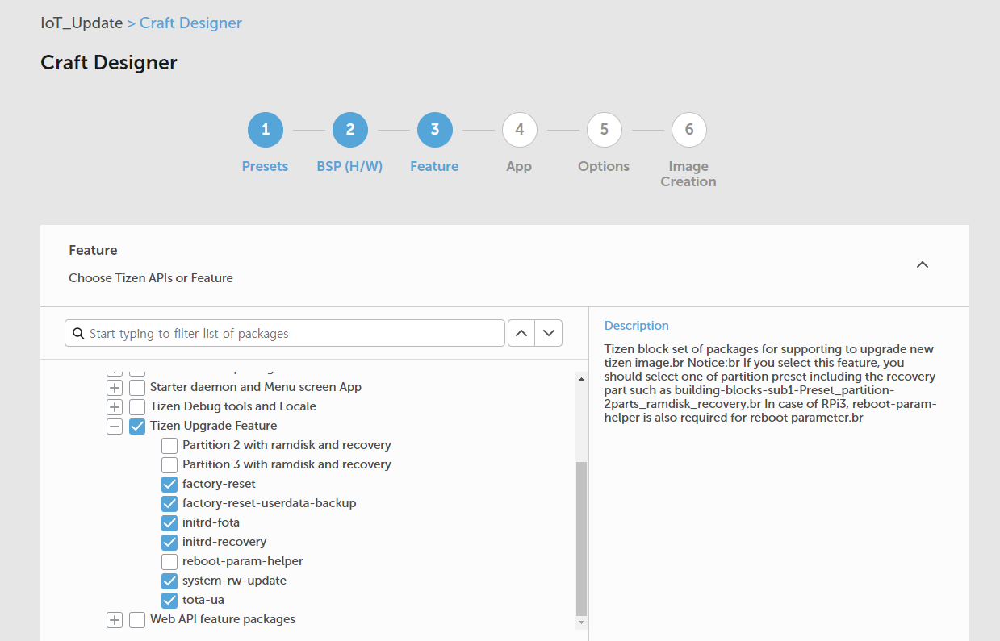
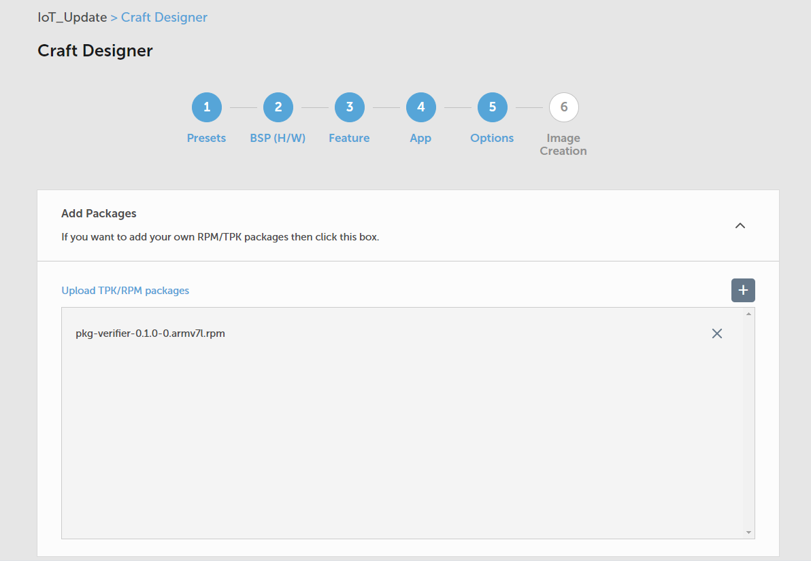
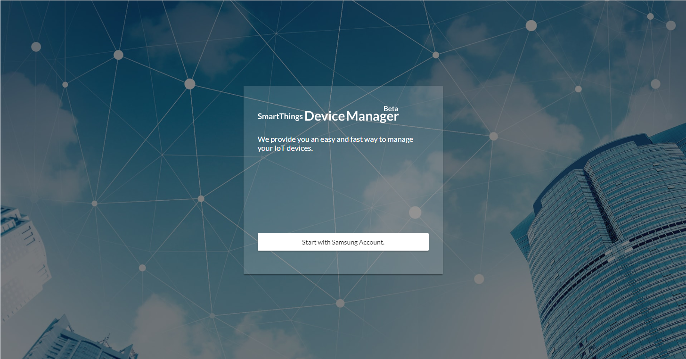
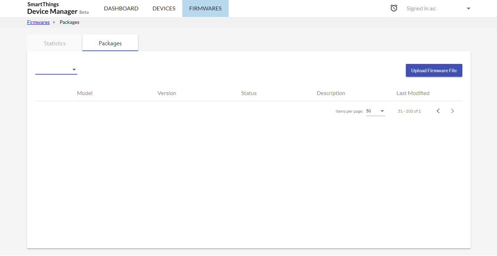
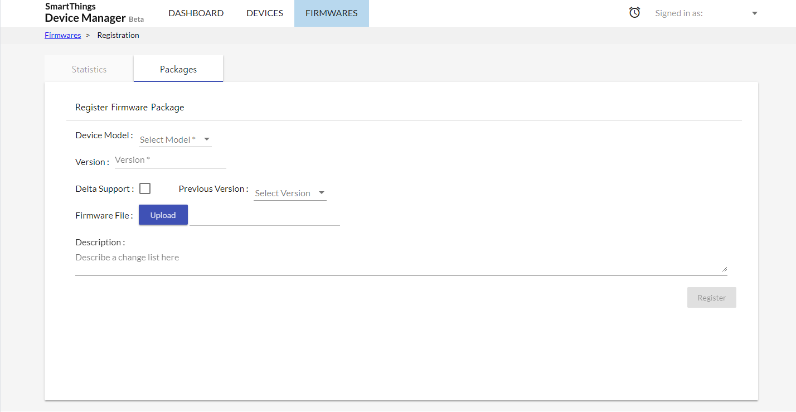

# Tizen IoT Software Update with STDM

- [Prerequisites](#prerequisites)
- [Registering IoT device](#registering-iot-device)
- [Creating Updatable Image](#creating-updatable-image)
- [Making and Uploading Update Package](#making-and-uploading-update-package)

Tizen IoT offers an *update agent* which enables user to update the device through the STDM ([SmartThings Device Manager](https://console.smartthingsdm.com/)). Once the IoT device is registered to STDM, the device's software can be updated by SmartThings controller.

## Prerequisites

1. Setting up for **SmartThings**
Because the *update agent* works on SmartThings, the device should have been connected to SmartThings Cloud. For more information, refer to Tizen IoT [Getting Started with Tizen](https://developer.tizen.org/development/iot-preview/getting-started).

2. Signing up STDM as manufacturer admin
Sign up STDM and request a role of manufacturer: [STDM - Requiring manufacturer admin role]().

3. Registering IoT Device
The devices which want to connect to STDM are supposed to be registered at STDM in advance: [STDM - Register device certificate]().

## Creating Updatable Image

The Tizen IoT image which is able to be updated through the STDM must include some feature: *Tizen Upgrade Feature*.

### Making Tizen Image: Craftroom

Tizen IoT image can be created by [Craftroom](https://craftroom.tizen.org/).
To make an image enable update, check `Tizen Upgrade Feature` at **Feature** step.

**Figure: Making image using Craftroom**


### Making Tizen Image: MIC

Tizen IoT image also can be created by [MIC](https://source.tizen.org/documentation/reference/mic-image-creator).
To make an image enable update, lists `Feature Upgrade building block` at **kickstart** file's **%packages** section.
```
%packages
  :
building-blocks-sub1-domain_Feature-Upgrade
  :
%end
```

## Making and Uploading Update Package

The *Update Package* is an archive file which will be used during actual update process. It is created based on the platform image of update target version.

### Making Update Package

Following tool is for making the update package of Tizen IoT image:
[Update Package Generator](media/update_package_generator.tar.gz)
This tool is consist of bash/python scripts.

After decompress the above file, you can make an update package of new image through `tota_package_generator`:
```bash
$ ./tota_package_generator -p pre.sh artik_config.cfg <new image>
```

### Signing Update Package

Software Update means that all the base operating system can be modified. Therefore update using contaminated firmware could cause critical problem. The *Tizen system update* offers a framework to verify update package before proceeding an actual update. The developers can make their own signing/verifying mechanism for update package and apply it by including their own verifier into Tizen image.
The update package verifier can be installed to Tizen image if it is packaged as an RPM. Both of imaging methods ([Craftroom](https://craftroom.tizen.org/), [MIC](https://source.tizen.org/documentation/reference/mic-image-creator)) support the way to include user package. The scratch code for RPM packaging of package verifier is offered as bellow:
[Update Package Verifier Sample](media/update_package_verifier.tar.gz)

- Hierarchy
  ```
  pkg_verifier/
  ├── 41-upg_verifier.list
  ├── CMakeLists.txt
  ├── LICENSE
  ├── main.c
  └── packaging
    └── pkg-verifier.spec
  ```

### Implementing Verifier
The platform distributer can implement their own package signer so they can use it to sign the package and verify it with a verifier which is corresponding to their signing mechanism. However because the verifier developed by distributer would be run by Tizen update process, they must follow the assumption: The verifier binary must **return 0** if the package is verified successfully, otherwise it may return proper error codes.

If the verifier requires some other binary or library (for example *openssl*), they need to be listed at *41-upg_verifier.list*:

**Example: Requiring *openssl***
```
WITHLIBS="
/bin/openssl
"
```
The listed files also must be included in Tizen image itself. The way to include the custom package in Tizen image is described at bellow [Including Package into Image](#including-package-into-image).

### Building Package
Build pkg-verifier using [GBS](https://source.tizen.org/documentation/reference/git-build-system/usage/gbs-build).
```bash
$ gbs build -A {Architecture}
```
The result package will be generated like: *pkg-verifier-{version}.{arch}.rpm*

### Including Package into Image
#### Craftroom
At the *Options* step, the package user want to add can be uploaded and it will be installed at creating image.

**Figure: Adding user package in Craftroom**


#### MIC
The local packages placed in specific directory are installed during imaging by *--local-pkgs-path* option.
```bash
$ ls pkgs
pkg-verifier-0.1.0-0.armv7l.rpm
$ mic create ... --local-pkgs-path="pkgs"
```

### Uploading Update Package

**Prerequisites**: This task requires Samsung account with [STDM manufacturer admin role]().

1. Sign in [SmartThings Device Manager](https://console.smartthingsdm.com/login).


2. Go to *FIRMWARES* > *Packages*


3. Click *Upload Firmware File*

4. Fill out the form and click the *Register* button.


After the update package for new version is uploaded successfully, the IoT devices can find it and be updated through the *update agent*.
